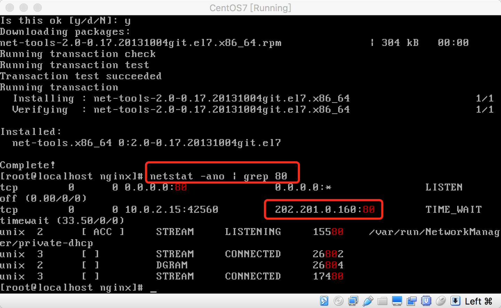
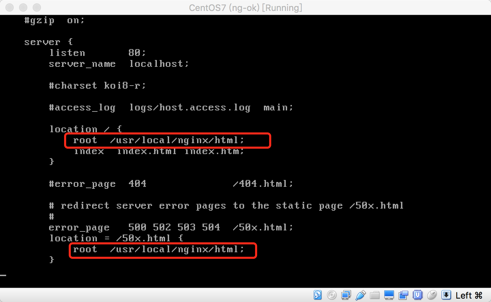
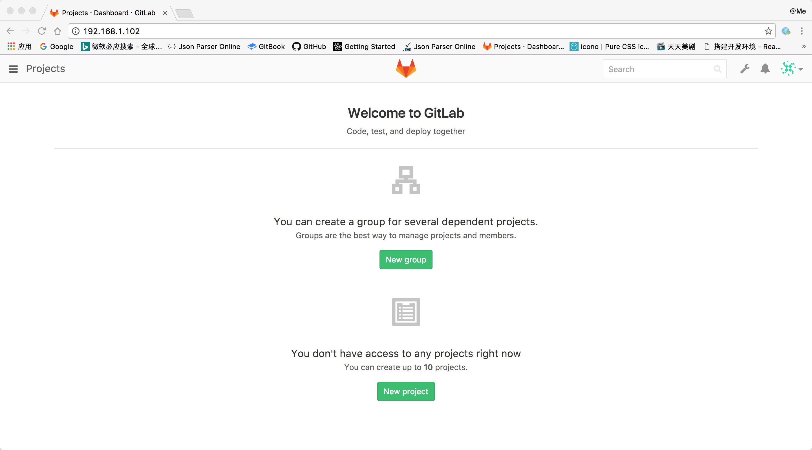

# i-gitlab
Configure gitlab step by step

_我是在虚拟机安装的网络配置需选择桥接的方式才能配置一个本地IP，NAT是没有IP的哟_

## Dependencies

- Linux OS (CentOS)
- Nginx
- Gitlab Package

## Download dependencies

- [centos.org download](https://www.centos.org/download/)   
- [jaywcjlove handbook](https://github.com/jaywcjlove/handbook/blob/master/Centos/nginx%E5%AE%89%E8%A3%85.md)   
- [nginx.cn install](http://www.nginx.cn/install)   

## Install nginx

### 安装prce和openssl

```shell
yum -y install pcre*
yum -y install openssl*
```

### Download && Install nginx

[nginx目录](http://nginx.org/download)

```shell
# 提示 wget command not found 先安装wget

yum -y install wget
```

```
wget http://nginx.org/download/"Your_nginx_version".tar.gz
```

下载完成后解压文件到指定目录`/usr/local/src` and then...

```shell
# 提示 C compiler cc is not found 先安装编译环境

yum install gcc gcc-c++ ncurses-devel perl
```

```shell
# 提示 require zlib 先安装zlib
cd /usr/local/src

wget http://zlib.net/zlib-1.2.10.tar.gz
tar -zxvf zlib-1.2.10.tar.gz
cd zlib-1.2.10
./configure
make
make install
```

```shell
# 提示 netstat command not found 先安装 net-tools

yum install net-tools
```

```shell
cd nging-*

./configure

make
make install 
```

查看nginx ip
```shell
netstat -ano|grep 80
```



#### 启动nginx

```shell
/usr/local/nginx/sbin/nginx
```

ng已启动但是没有显示ng的页面查看`conf/nginx.config` 中的`location root`配置路径是否正确，这里需要配置绝对路径，我配置相对的是没成功。




### nginx 常用命令

```
# 启动
/usr/local/nginx/sbin/nginx

# 重启
/usr/local/nginx/sbin/nginx -s reload

# 关闭进程
/usr/local/nginx/sbin/nginx -s stop
```

## Install gitlab

[jaywcjlove handbook](https://github.com/jaywcjlove/handbook/blob/master/Centos/gitlab%E5%AE%89%E8%A3%85.md)

## Install python and ruby

```shell
yum install python 

yum install ruby 
```

and **`reboot`** ,    

启动ng和gitlab服务`/usr/local/nginx/sbin/nginx` `gitlab-ctl start`     

👌，查看自己机器的IP访问gitlab吧，，，

刚进入的时候会重置密码，然后进行登录，最终效果如下啦：



### gitlab 常用命令

```
# 启动所有 gitlab 组件：
sudo gitlab-ctl start

# 停止所有 gitlab 组件：
sudo gitlab-ctl stop

# 重启所有 gitlab 组件：
sudo gitlab-ctl restart
```
