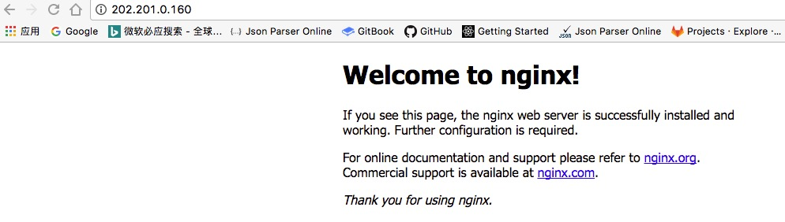

# i-gitlab
Configure gitlab step by step

_我是在虚拟机安装的网络配置需选择桥接的方式才能配置一个本地IP，NAT是没有IP的哟_

## Dependencies

- Linux OS (CentOS)
- Nginx
- Gitlab Package

## Download dependencies

- [centos.org download](https://www.centos.org/download/)   
- [jaywcjlove handbook](https://github.com/jaywcjlove/handbook/blob/master/Centos/nginx%E5%AE%89%E8%A3%85.md)   
- [nginx.cn install](http://www.nginx.cn/install)   

## download centos

click [centos.org download](https://www.centos.org/download/) to download centos ,and you will see the website like below

 choose `minimal iso ` is ok,

then configure your virtual machine, while there is no option name centos ,so you would like to choose `linux os` and configure the network `桥接 bridge connection` . after everything is done ,let's begin.


## install nginx
Before install nginx we need to install some dependencies like wget ,pcre and openssl.

### install wget 

```shell
yum -y install wget
```

if the command line show [`Cannot find a valid baseurl for repo`](http://www.111cn.net/sys/CentOS/89958.htm) ,maybe you should edit the `/etc/sysconfig/network-scripts/ifcfg-eth*` file ,change to `ONBOOT=yes` and reload the network with `service network restart`


### install pcre and openssl  

```shell
yum -y install pcre* # * cannot be dismissed
yum -y install openssl*
```

click [nginx目录](http://nginx.org/download) to choose a nginx version (*nginx-1.9.9.tar.gz*),and install it 

```shell
# 如：wget http://nginx.org/download/nginx-1.9.9.tar.gz

wget http://nginx.org/download/"Your_nginx_version".tar.gz
```

after downloaded you will see the nginx file in your `current directory`

### install gcc
编译环境

```shell
# 提示 C compiler cc is not found 先安装编译环境

yum install gcc gcc-c++ ncurses-devel perl
```

### install netstat
查看网络状态

```shell
# 提示 netstat command not found 先安装 net-tools

yum install net-tools
```

### install zlib

[zlib](http://zlib.net/) select zlib version to install.

```shell
wget http://zlib.net/zlib-1.2.10.tar.gz
tar -zxvf zlib-1.2.10.tar.gz
cd zlib-1.2.10
./configure
make
make install
```

### unzip nginx file
unzip ungix file to this directory `/usr/local/src` with command `tar -zxvf zlib-1.2.10.tar.gz`

```shell
tar -zxvf nginx-1.9.9.tar.gz

cd nginx-1.9.9

./configure

make
make install 
```

查看IP `ip addr`,端口占用 `netstat -ano | grep 80`

### check nginx status

```shell
/usr/local/nginx/sbin/nginx
```

### start nginx

```shell
/usr/local/nginx/sbin/nginx
```

关闭防火墙`vi /etc/sysconfig/iptables` 添加80端口开放`-A INPUT -m state --state NEW -m tcp -p tcp --dport 80 -j ACCEPT`

ng已启动但是没有显示ng的页面查看`conf/nginx.config` 中的`location root`配置路径是否正确，这里需要配置绝对路径，我配置相对的是没成功。




### nginx 常用命令

```
# 启动
/usr/local/nginx/sbin/nginx

# 重启
/usr/local/nginx/sbin/nginx -s reload

# 关闭进程
/usr/local/nginx/sbin/nginx -s stop
```

## Install gitlab

[jaywcjlove handbook](https://github.com/jaywcjlove/handbook/blob/master/Centos/gitlab%E5%AE%89%E8%A3%85.md)

### create file `gitlab-ce.repo`

`touch /etc/yum.repos.d/gitlab-ce.repo` 添加[清华镜像](https://mirror.tuna.tsinghua.edu.cn/help/gitlab-ce/) 选择centos-7并将内容复制到该文件

```
[gitlab-ce]
name=gitlab-ce
baseurl=http://mirrors.tuna.tsinghua.edu.cn/gitlab-ce/yum/el7
repo_gpgcheck=0
gpgcheck=0
enabled=1
gpgkey=https://packages.gitlab.com/gpg.key
```

然后

```shell
sudo yum makecache

sudo yum install gitlab-ce
```


编辑`vim /etc/gitlab/gitlab.rb`
```
# 找到 external_url 'http://修改为你自己的IP'然后执行

sudo gitlab-ctl reconfigure
```

### Install python and ruby

```shell
yum install python 

yum install ruby 
```

and **`reboot`** ,    

启动ng和gitlab服务`/usr/local/nginx/sbin/nginx` `gitlab-ctl start`     

👌，查看自己机器的IP访问gitlab吧，，，

刚进入的时候会重置密码，然后进行登录，最终效果如下啦：


### gitlab 常用命令

```
# 启动所有 gitlab 组件：
sudo gitlab-ctl start

# 停止所有 gitlab 组件：
sudo gitlab-ctl stop

# 重启所有 gitlab 组件：
sudo gitlab-ctl restart
```
